# Mastra.ai Examples Architecture Guide

This guide documents the design, data flow, and class relationships for each sequential learning example we build.

---

## 📂 Example 01: HelloWorld

### Description
Demonstrates the simplest integration of Mastra. A main entry point initializes Mastra with a single Agent, calls it, and retrieves the response.

### 📐 Relationship Diagram

```mermaid
graph TD
    subgraph Execution Entry
        Main["Main Script (test-summarizer.ts / ex01-helloworld.ts)"]
    end

    subgraph Mastra Framework
        MastraContainer["Mastra (Core Container)"]
        AgentInstance["helloAgent (Agent)"]
    end

    subgraph External
        LLM["Google Gemini 3.5 Flash"]
    end

    Main -->|1. Retrieves Agent| MastraContainer
    MastraContainer -->|2. Returns Agent Instance| AgentInstance
    Main -->|3. Call agent.generate('Say hello...')| AgentInstance
    AgentInstance -->|4. Translates System Prompt & Prompt to API call| LLM
    LLM -->|5. Returns Raw Text Response| AgentInstance
    AgentInstance -->|6. Returns response.text| Main
```

### 📐 Sequence Diagram

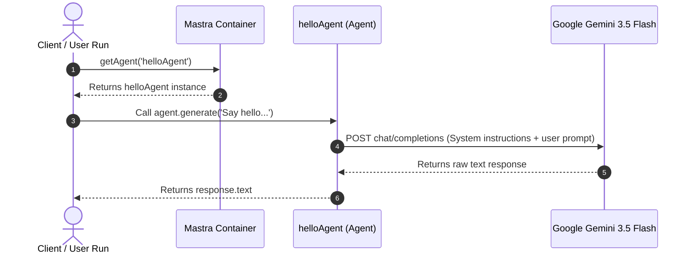

---

## 📂 Example 02: Adding Custom Tools (Zod-schema)

### Description
Equips an Agent with a mathematical computation tool. Demonstrates tool discovery, schema-validation using Zod, execution routing, and final answer generation.

### 📐 Relationship Diagram

```mermaid
graph TD
    subgraph Execution Entry
        Main["Main Script (ex02-tools.ts)"]
    end

    subgraph Mastra Framework
        MastraContainer["Mastra (Core Container)"]
        AgentInstance["mathAgent (Agent)"]
        ToolInstance["calculatorTool (Tool)"]
    end

    subgraph External LLM
        LLM["Google Gemini 3.5 Flash"]
    end

    Main -->|1. Retrieves Agent| MastraContainer
    MastraContainer -->|2. Returns Agent Instance| AgentInstance
    Main -->|3. Call agent.generate('What is 142 * 47?')| AgentInstance
    
    %% Loop for function calling
    AgentInstance -->|4. Send Prompt + Tool Schema definition| LLM
    LLM -->|5. Decides to call tool with arguments: {operation: 'multiply', a: 142, b: 47}| AgentInstance
    
    AgentInstance -->|6. Validate arguments & invoke execute()| ToolInstance
    ToolInstance -->|7. Runs typescript math operation| ToolInstance
    ToolInstance -->|8. Returns output {result: 6674}| AgentInstance
    
    AgentInstance -->|9. Send tool execution output back to model| LLM
    LLM -->|10. Synthesizes natural language answer| AgentInstance
    
    AgentInstance -->|11. Returns final text response| Main
```

### 📐 Sequence Diagram

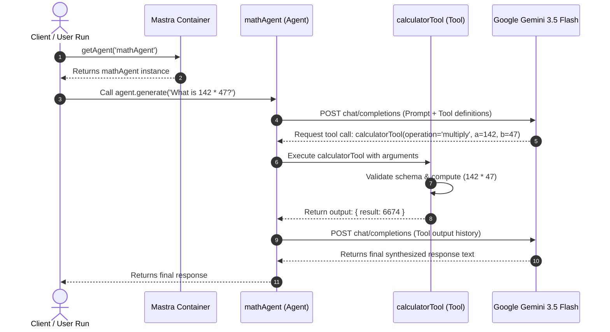

---

## 📂 Example 03: Multiple tools under Mathagent

### Description
Registers three distinct mathematical tools (factorial, Fibonacci, and primality check) with a single Agent. Demonstrates how the LLM dynamically decides which tools to invoke, and how it can execute multiple different tools sequentially or in parallel depending on the user query.

### 📐 Relationship Diagram

```mermaid
graph TD
    subgraph Execution Entry
        Main["Main Script (ex03-multiple-tools.ts)"]
    end

    subgraph Mastra Framework
        MastraContainer["Mastra (Core Container)"]
        AgentInstance["multiMathAgent (Agent)"]
        
        %% Tools registry
        ToolFib["fibonacciTool (Tool)"]
        ToolPrime["primeCheckTool (Tool)"]
        ToolFact["factorialTool (Tool)"]
    end

    subgraph External LLM
        LLM["Google Gemini 3.5 Flash"]
    end

    Main -->|1. Retrieves Agent| MastraContainer
    MastraContainer -->|2. Returns Agent Instance| AgentInstance
    Main -->|3. Call agent.generate('Find the 10th Fibonacci and check if it is prime')| AgentInstance
    
    AgentInstance -->|4. Send Prompt + Tool definitions| LLM
    
    %% Multi-turn tool execution
    LLM -->|5. Request tool: fibonacciTool {n: 10}| AgentInstance
    AgentInstance -->|6. Run| ToolFib
    ToolFib -->|7. Return {value: 55}| AgentInstance
    
    AgentInstance -->|8. Feed output back| LLM
    
    LLM -->|9. Request tool: primeCheckTool {number: 55}| AgentInstance
    AgentInstance -->|10. Run| ToolPrime
    ToolPrime -->|11. Return {isPrime: false, ...}| AgentInstance
    
    AgentInstance -->|12. Feed output back| LLM
    LLM -->|13. Generate final answer explaining 55 is not prime| AgentInstance
    AgentInstance -->|14. Returns response| Main
```

### 📐 Sequence Diagram

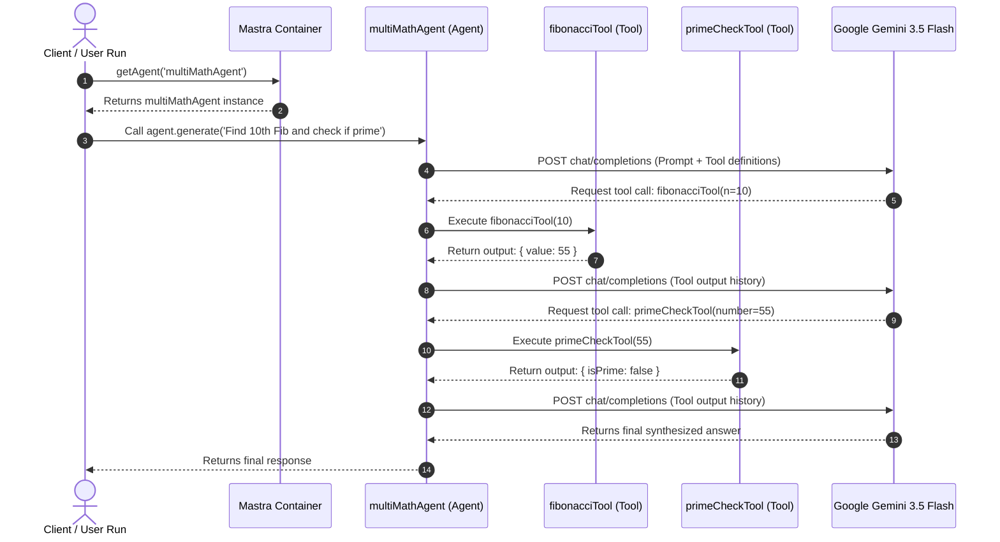

---

## 📂 Example 04: Persistent Conversation Memory

### Description
Creates a stateful `tutorAgent` configured with a `Memory` instance. Demonstrates how Mastra intercepts the call to `.generate()`, retrieves previous message history associated with a specific `threadId` from the storage database, appends the history to the LLM context, and saves the new messages automatically.

### 📐 Relationship Diagram

```mermaid
graph TD
    subgraph Execution Entry
        Main["Main Script (ex04-memory.ts)"]
    end

    subgraph Mastra Framework
        MastraContainer["Mastra (Core Container)"]
        AgentInstance["tutorAgent (Agent)"]
        MemoryStore["Memory Layer (Memory Class)"]
        DBStore["libSQL/SQLite DB (mastra.db)"]
    end

    subgraph External LLM
        LLM["Google Gemini 3.5 Flash"]
    end

    Main -->|1. Retrieves Agent| MastraContainer
    MastraContainer -->|2. Returns Agent Instance| AgentInstance
    
    %% Turn 1
    Main -->|3. Call agent.generate(Prompt_1, { memory: { thread, resource } })| AgentInstance
    AgentInstance -->|4. Checks history for thread| MemoryStore
    MemoryStore -->|5. Query DB (returns empty for new thread)| DBStore
    AgentInstance -->|6. Send Prompt_1 to Model| LLM
    LLM -->|7. Return Response_1| AgentInstance
    AgentInstance -->|8. Save Prompt_1 & Response_1| MemoryStore
    MemoryStore -->|9. Write to DB| DBStore
    AgentInstance -->|10. Return Response_1| Main
    
    %% Turn 2
    Main -->|11. Call agent.generate(Prompt_2, { memory: { thread, resource } })| AgentInstance
    AgentInstance -->|12. Checks history for thread| MemoryStore
    MemoryStore -->|13. Query DB (returns Prompt_1 & Response_1)| DBStore
    AgentInstance -->|14. Send [Prompt_1, Response_1, Prompt_2] to Model| LLM
    LLM -->|15. Return Response_2 (with context)| AgentInstance
    AgentInstance -->|16. Save Prompt_2 & Response_2| MemoryStore
    MemoryStore -->|17. Write to DB| DBStore
    AgentInstance -->|18. Return Response_2| Main
```

### 📐 Sequence Diagram

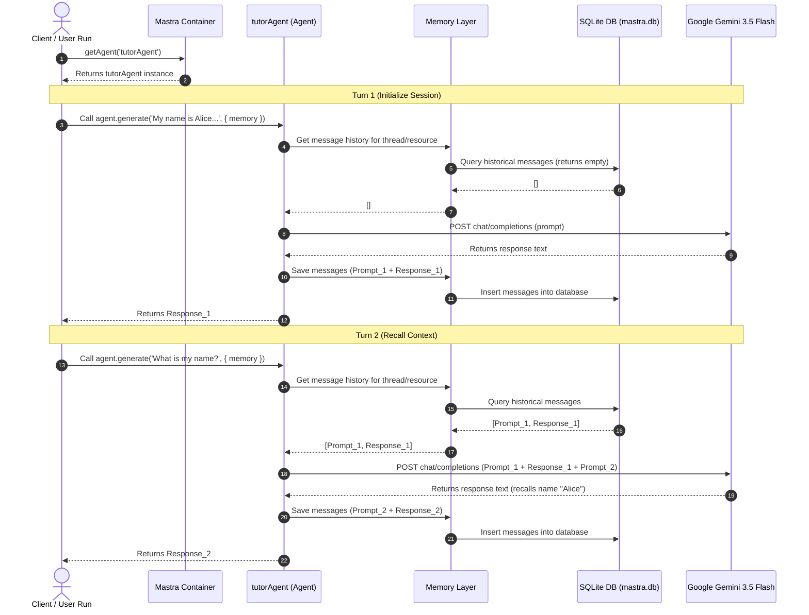

---

## 📂 Example 05: Response Evaluation (Evals)

### Description
Defines a custom deterministic evaluation scorer `codeBlockScorer`. The main script executes an LLM generation request, captures the response, and manually runs the scorer object against the input and output variables to evaluate and grade formatting compliance.

### 📐 Relationship Diagram

```mermaid
graph TD
    subgraph Execution Entry
        Main["Main Script (ex05-evals.ts)"]
    end

    subgraph Mastra Framework
        MastraContainer["Mastra (Core Container)"]
        AgentInstance["codeAgent (Agent)"]
        ScorerInstance["codeBlockScorer (Scorer)"]
    end

    subgraph External LLM
        LLM["Google Gemini 3.5 Flash"]
    end

    Main -->|1. Retrieves Agent| MastraContainer
    MastraContainer -->|2. Returns Agent Instance| AgentInstance
    Main -->|3. Call agent.generate(Prompt)| AgentInstance
    AgentInstance -->|4. Get Response| LLM
    LLM -->|5. Return code snippet| AgentInstance
    AgentInstance -->|6. Return response.text| Main
    
    %% Scorer Execution
    Main -->|7. Invoke codeBlockScorer.run({input, output})| ScorerInstance
    ScorerInstance -->|8. Preprocess (extract text)| ScorerInstance
    ScorerInstance -->|9. Analyze (check for markdown ```)| ScorerInstance
    ScorerInstance -->|10. Generate Score (0 or 1)| ScorerInstance
    ScorerInstance -->|11. Generate Reason string| ScorerInstance
    Main -->|12. Return Eval Result| Main
```

### 📐 Sequence Diagram

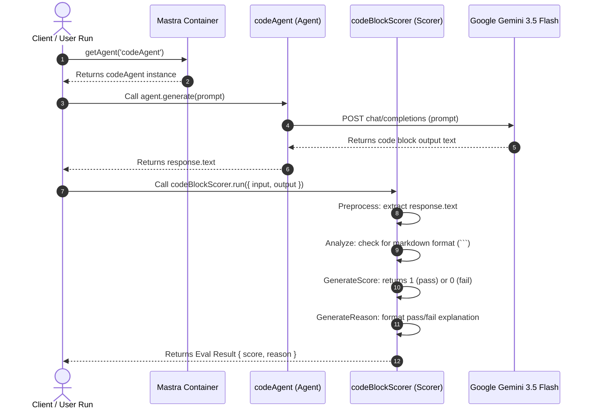

---

## 📂 Example 06: LiteLLM Proxy Integration (Custom Gateways)

### Description
Creates a custom `LiteLLMGateway` by extending the `MastraModelGateway` class. The custom gateway routes language model requests to a local proxy (representing LiteLLM) rather than querying default provider endpoints. The mock LiteLLM proxy captures telemetry, usage logs, cost estimates, and outputs them locally.

### 📐 Relationship Diagram

```mermaid
graph TD
    subgraph Execution Entry
        Main["Main Script (ex06-litellm.ts)"]
    end

    subgraph Mastra Framework
        MastraContainer["Mastra (Core Container)"]
        AgentInstance["litellmAgent (Agent)"]
        GatewayInstance["LiteLLMGateway (Custom Gateway)"]
    end

    subgraph Proxy Proxy
        LiteLLM["LiteLLM Proxy Server (Mock Port 4000)"]
    end

    subgraph External LLMs
        LLM["Real Provider APIs (e.g. OpenAI / Google / Anthropic)"]
    end

    Main -->|1. Retrieves Agent| MastraContainer
    MastraContainer -->|2. Returns Agent Instance| AgentInstance
    Main -->|3. Call agent.generate(Prompt)| AgentInstance
    
    AgentInstance -->|4. Resolve model| GatewayInstance
    GatewayInstance -->|5. Build URL / Client targeting http://localhost:4000| GatewayInstance
    
    AgentInstance -->|6. POST request to proxy /chat/completions| LiteLLM
    
    %% LiteLLM action
    LiteLLM -->|7. Capture and log: Model, Prompt Tokens, Timestamp, Cost| LiteLLM
    LiteLLM -->|8. Proxy request (if live)| LLM
    LLM -->|9. Return response data| LiteLLM
    
    LiteLLM -->|10. Return OpenAI-compatible response payload| AgentInstance
    AgentInstance -->|11. Return response.text| Main
```

### 📐 Visual Architecture

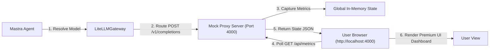

### 📐 Sequence Diagram

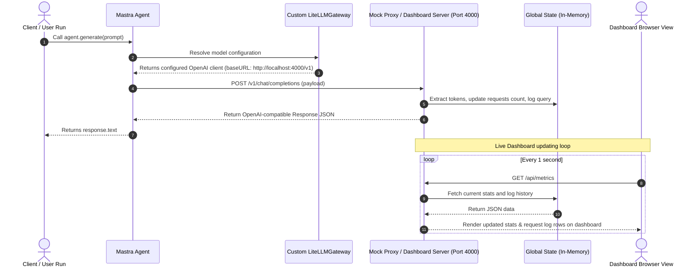

---

## 📂 Example 07: Standalone LiteLLM Server & Multi-Agent Client Routing

### Description
Separates the HTTP proxy server and dashboard into its own standalone process (`ex07-litellm-server.ts`), running persistently on port 4000. A separate client program (`ex07-agents-client.ts`) initiates multiple distinct agents (`writerAgent` and `coderAgent`), routing their model generation queries through the standalone LiteLLM server using a custom gateway that maps their provider identifiers in headers.

### 📐 Relationship Diagram

```mermaid
graph TD
    subgraph Client Process (ex07-agents-client.ts)
        Main["Main Client Runner"]
        Writer["writerAgent (Agent)"]
        Coder["coderAgent (Agent)"]
        Gateway["LiteLLMGateway (Mastra Custom Gateway)"]
    end

    subgraph Standalone Proxy Process (ex07-litellm-server.ts)
        Proxy["LiteLLM Mock Proxy Server (Port 4000)"]
        State["In-Memory State (Logs, Costs, Per-Agent Stats)"]
        Dashboard["Dashboard UI (HTML/JS)"]
    end

    Main -->|1. Triggers| Writer
    Main -->|2. Triggers| Coder
    
    Writer -->|Resolve gpt-4o| Gateway
    Coder -->|Resolve gpt-4o| Gateway
    
    Gateway -->|3. POST completions with x-mastra-provider header| Proxy
    
    Proxy -->|4. Update Logs & Stats for WRITER or CODER| State
    Dashboard -->|5. Reads Metrics| State
```

### 📐 Visual Architecture

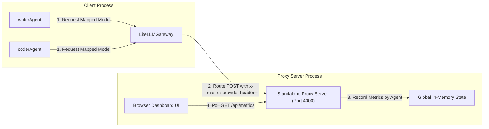

### 📐 Sequence Diagram

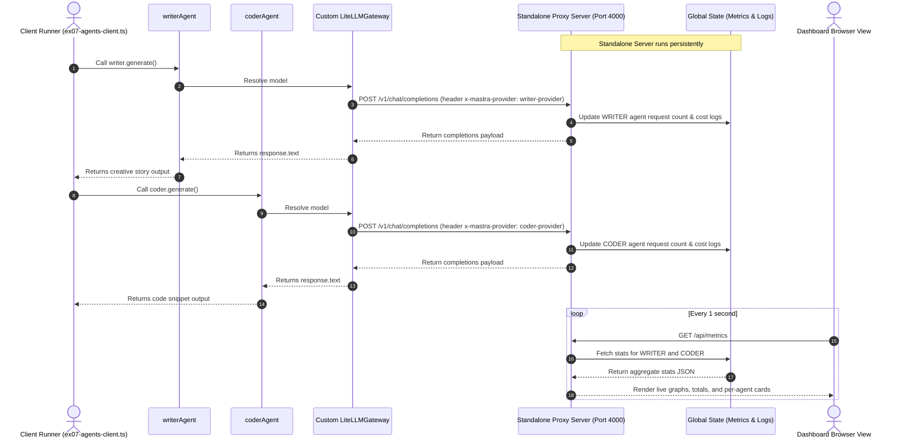

---

## 📂 Example 08: Real LiteLLM Proxy Server Integration

### Description
Integrates the official **LiteLLM python proxy server** (from BerriAI) running persistently on port 4000. It routes model requests via a local `litellm-config.yaml` mapping, translating OpenAI `gpt-4o` request payloads into Google `gemini-3.1-flash-lite` calls using your exported API key. The official LiteLLM Admin UI dashboard, complete playground, and metrics tracking pages are served natively by the LiteLLM server out-of-the-box.

### 📋 Prerequisites & Setup
To run this example successfully with a fully functioning database-backed Admin UI:

1. **Start the local PostgreSQL container:**
   ```bash
   docker run -d --name mastra-postgres -e POSTGRES_PASSWORD=postgres -e POSTGRES_DB=litellm -p 5432:5432 postgres:latest
   ```

2. **Install Prisma and generate schema binaries:**
   ```bash
   source venv/bin/activate
   pip install prisma
   prisma generate --schema venv/lib/python3.13/site-packages/litellm/proxy/schema.prisma
   ```

3. **Run the LiteLLM proxy:**
   ```bash
   source venv/bin/activate
   export $(grep -v '^#' .env | xargs)
   litellm --config litellm-config.yaml --port 4000
   ```

4. **Login credentials for the Admin Dashboard at `http://localhost:4000/ui`:**
   * **Username:** `admin`
   * **Password / Master Key:** `sk-mastra-proxy-key-123`


### 📐 Relationship Diagram

```mermaid
graph TD
    subgraph Client Process (ex08-real-litellm.ts)
        Main["Main Client Runner"]
        Writer["writerAgent (Agent)"]
        Coder["coderAgent (Agent)"]
        Gateway["LiteLLMRealGateway (Mastra Custom Gateway)"]
    end

    subgraph Standalone Official Proxy Process (Python venv)
        LiteLLM["Official LiteLLM Proxy (Port 4000)"]
        Config["litellm-config.yaml (gpt-4o -> gemini-3.1-flash-lite)"]
        AdminUI["Official LiteLLM Admin UI Dashboard"]
    end

    subgraph External LLM API
        Gemini["Google Gemini 3.1 Flash Lite"]
    end

    Main -->|1. Triggers| Writer
    Main -->|2. Triggers| Coder
    
    Writer -->|Resolve gpt-4o| Gateway
    Coder -->|Resolve gpt-4o| Gateway
    
    Gateway -->|3. Route POST /v1/chat/completions| LiteLLM
    LiteLLM -->|4. Read configuration mapping| Config
    LiteLLM -->|5. Forward payload to Gemini| Gemini
    
    Gemini -->|6. Return response content| LiteLLM
    LiteLLM -->|7. Return OpenAI-compatible response| Gateway
    
    LiteLLM -->|8. Record metrics / telemetry data| AdminUI
```

### 📐 Visual Architecture

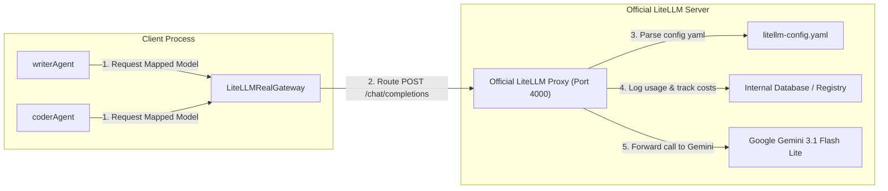

### 📐 Sequence Diagram

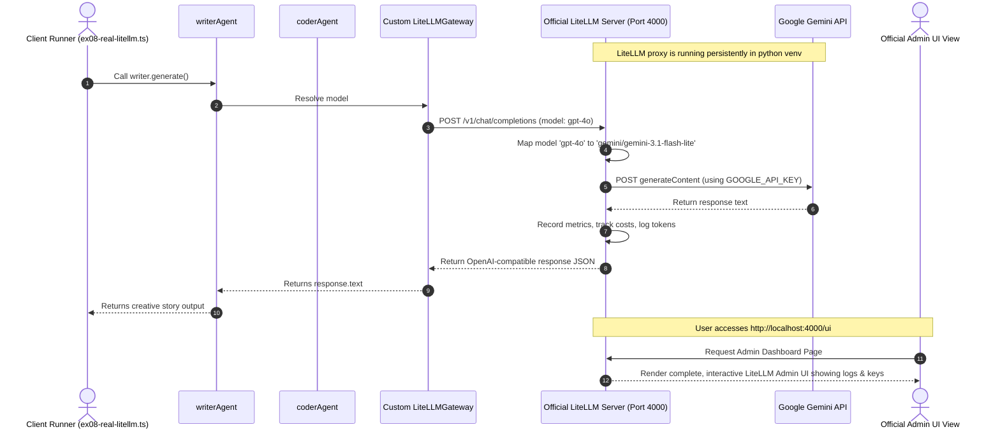

---

## 📂 Example 09: Workflows & Directed Acyclic Graphs (DAGs)

### Description
Demonstrates Mastra's **Workflows API** (`createStep` and `createWorkflow`) by building a multi-agent text processing pipeline. It chains three distinct execution blocks (DAG nodes) together:
1. **`write-draft` Step:** An agentic step querying the `writerAgent` via LiteLLM to create a raw story draft.
2. **`analyze-draft` Step:** A deterministic javascript step analyzing the draft metrics (word count and character count).
3. **`edit-draft` Step:** An agentic step querying the `editorAgent` via LiteLLM, providing the raw draft and analyzed metrics to generate a polished final story.

Both agents query the local database-backed LiteLLM Proxy on port 4000, which routes calls to `gemini-3.1-flash-lite` on the Google Gemini API.

### 📐 Relationship Diagram

```mermaid
graph TD
    subgraph Client Process (ex09-workflows.ts)
        Main["Main Client Runner"]
        Workflow["contentPipelineWorkflow (Mastra Workflow)"]
        
        stepA["writeStep (Step 1)"]
        stepB["analyzeStep (Step 2)"]
        stepC["editStep (Step 3)"]
        
        Writer["writerAgent (Agent)"]
        Editor["editorAgent (Agent)"]
        Gateway["LiteLLMRealGateway"]
    end

    subgraph Official Proxy Server (Port 4000)
        LiteLLM["Official LiteLLM Proxy"]
    end

    subgraph External LLM API
        Gemini["Google Gemini 3.1 Flash Lite"]
    end

    Main -->|1. Triggers run.start()| Workflow
    
    Workflow -->|2. Runs first node| stepA
    stepA -->|Generate draft prompt| Writer
    Writer -->|Resolve gpt-4o| Gateway
    
    stepA -->|3. Pipes draft output| stepB
    stepB -->|4. Computes word/char metrics & pipes| stepC
    stepC -->|Refine draft prompt| Editor
    Editor -->|Resolve gpt-4o| Gateway
    
    Gateway -->|5. Forward API calls| LiteLLM
    LiteLLM -->|6. Call completions endpoint| Gemini
    
    stepC -->|7. Return final result| Workflow
    Workflow -->|8. Return success state| Main
```

### 📐 Visual Architecture

```mermaid
graph LR
    subgraph Mastra Workflow Engine
        Input[Initial Input: Topic] -->|1. Starts| Write["write-draft (Step 1)"]
        Write -->|2. Outputs: draft| Analyze["analyze-draft (Step 2)"]
        Analyze -->|3. Outputs: word/char count| Edit["edit-draft (Step 3)"]
        Edit -->|4. Outputs: finalStory| Output[Final Output]
    end

    Write -.->|LLM call via Gateway| Proxy["LiteLLM Proxy (Port 4000)"]
    Edit -.->|LLM call via Gateway| Proxy
    Proxy ===> Gemini["Google Gemini API"]
```

### 📐 Sequence Diagram

```mermaid
sequenceDiagram
    autonumber
    actor User as Client Runner (ex09-workflows.ts)
    participant Workflow as contentPipeline
    participant writeStep as write-draft Step
    participant analyzeStep as analyze-draft Step
    participant editStep as edit-draft Step
    participant LiteLLM as LiteLLM Proxy (Port 4000)

    User->>Workflow: Run start(inputData: { topic })
    Workflow->>writeStep: execute()
    writeStep->>LiteLLM: POST /v1/chat/completions (via writerAgent)
    LiteLLM-->>writeStep: Return Raw Draft Text
    writeStep-->>Workflow: Return { draft }
    
    Workflow->>analyzeStep: execute(input: { draft })
    Note over analyzeStep: Compute wordCount & charCount
    analyzeStep-->>Workflow: Return { wordCount, charCount, draft }

    Workflow->>editStep: execute(input: { wordCount, charCount, draft })
    editStep->>LiteLLM: POST /v1/chat/completions (via editorAgent)
    LiteLLM-->>editStep: Return Refined Story Text
    editStep-->>Workflow: Return { finalStory }
    
    Workflow-->>User: Return status 'success' & { finalStory }
```

---

## 📂 Example 10: Agent-as-a-Service (AaaS) via LiteLLM

### Description
Organizes the multi-agent text processing and refinement pipeline into a clean, modular, self-contained directory (`src/examples/ex10-aaas/`).
It encapsulates:
*   `gateway.ts`: Resolves model API queries through the local official database-backed LiteLLM Proxy.
*   `agents/writer-agent.ts`: Generates a creative story draft based on a topic.
*   `agents/editor-agent.ts`: Refines drafts using structural evaluation metrics.
*   `workflows/content-pipeline.ts`: Composes the DAG content refinement sequence using `.then()`.
*   `index.ts`: The central Mastra instance exporting everything and hosting the client execution run.

The central `src/mastra/index.ts` imports the agents and workflows directly from this standalone folder, allowing `npx mastra dev` to automatically expose them as API endpoints to LiteLLM out-of-the-box.

### 📁 Directory Layout
```
src/examples/ex10-aaas/
├── agents/
│   ├── editor-agent.ts
│   └── writer-agent.ts
├── workflows/
│   └── content-pipeline.ts
├── gateway.ts
└── index.ts
```

### 📐 Relationship Diagram

```mermaid
graph TD
    subgraph Self-Contained Folder (src/examples/ex10-aaas/)
        Main["Main index.ts Client"]
        Workflow["contentPipeline (Mastra Workflow)"]
        Writer["writerAgent (Agent)"]
        Editor["editorAgent (Agent)"]
        Gateway["LiteLLMRealGateway"]
    end

    subgraph Central Registry (src/mastra/index.ts)
        MastraServer["npx mastra dev Server (Port 4111)"]
    end

    subgraph Official Proxy Server (Port 4000)
        LiteLLM["Official LiteLLM Proxy"]
    end

    subgraph External LLM API
        Gemini["Google Gemini 3.1 Flash Lite"]
    end

    MastraServer -->|Imports & registers| Writer
    MastraServer -->|Imports & registers| Editor
    MastraServer -->|Imports & registers| Workflow

    Main -->|1. Triggers run.start()| Workflow
    Workflow -->|2. Queries| Writer
    Workflow -->|3. Queries| Editor
    
    Writer -->|Resolve gpt-4o| Gateway
    Editor -->|Resolve gpt-4o| Gateway
    
    Gateway -->|4. Route POST /v1/chat/completions| LiteLLM
    LiteLLM -->|5. Forward API calls| Gemini
    
    LiteLLM -->|6. Logs prompt & telemetry metrics| DB["Postgres DB"]
```

### 📐 Sequence Diagram

```mermaid
sequenceDiagram
    autonumber
    actor User as Client Runner (ex10-aaas/index.ts)
    participant Workflow as contentPipeline (ex10-aaas)
    participant Gateway as Custom LiteLLMRealGateway
    participant LiteLLM as LiteLLM Proxy (Port 4000)
    participant MastraServer as Mastra dev Server (Port 4111)

    Note over MastraServer, LiteLLM: Mastra Dev server serves endpoints for ex10 agents & workflows
    
    User->>Workflow: Run start(inputData: { topic })
    Workflow->>Gateway: Resolve model 'gpt-4o' (via writerAgent)
    Gateway->>LiteLLM: POST /v1/chat/completions
    LiteLLM-->>Gateway: Return raw draft content
    
    Workflow->>Workflow: Execute analyze-draft Step
    
    Workflow->>Gateway: Resolve model 'gpt-4o' (via editorAgent)
    Gateway->>LiteLLM: POST /v1/chat/completions (refined draft)
    LiteLLM-->>Gateway: Return polished story
    
    Workflow-->>User: Return status 'success' & { finalStory }
```


