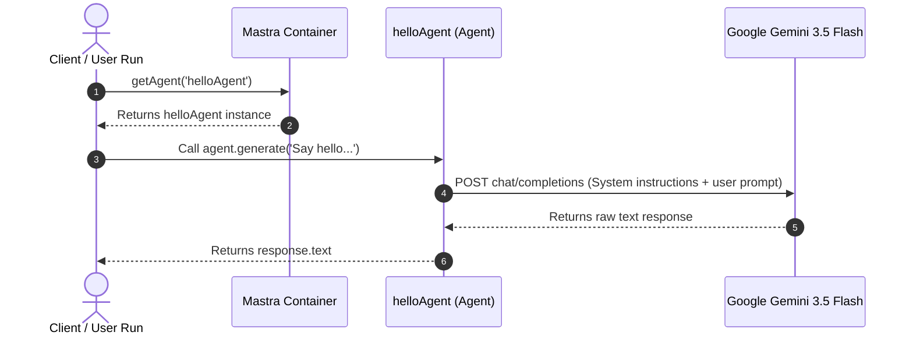
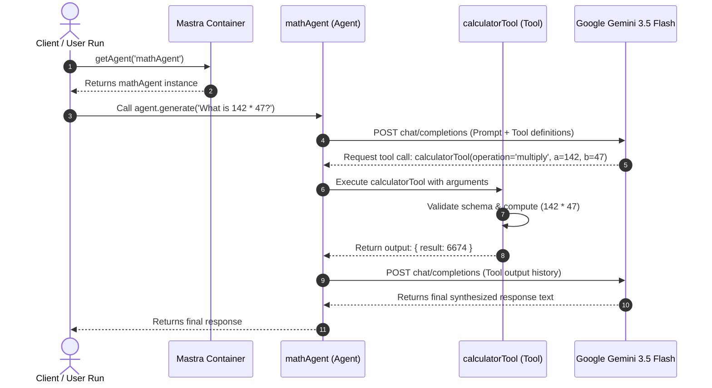
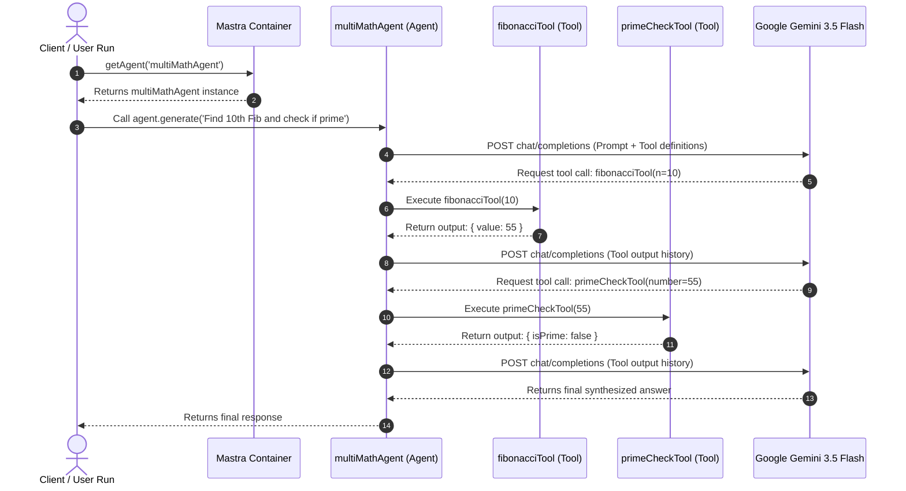
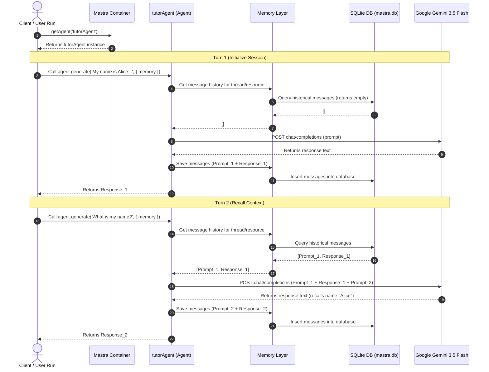
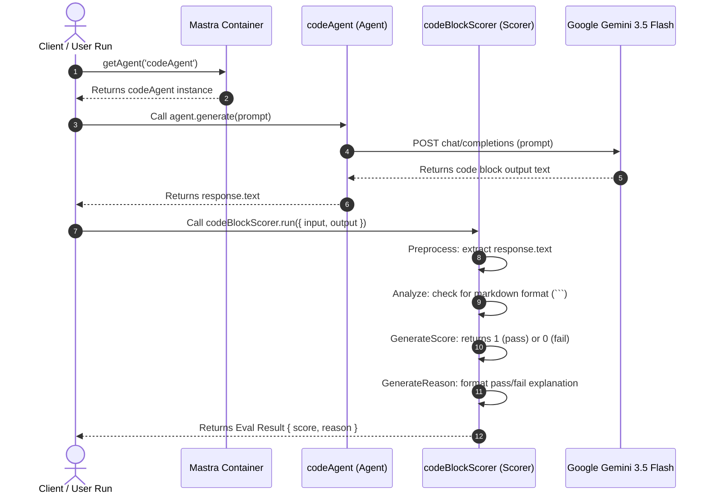
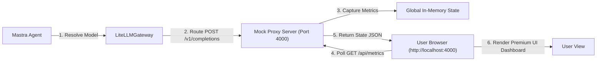
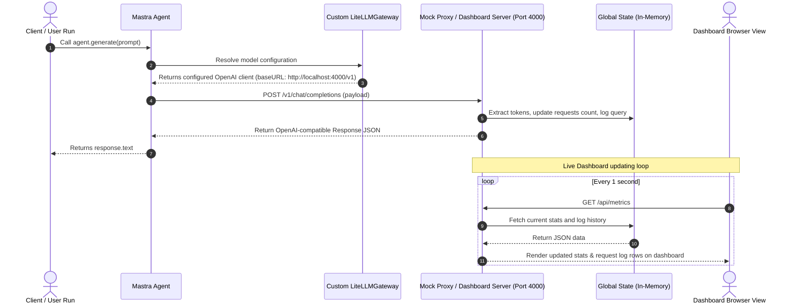

# Mastra.ai Examples Architecture Guide

This guide documents the design, data flow, and class relationships for each sequential learning example we build.

---

## 📂 Example 01: HelloWorld

### Description
Demonstrates the simplest integration of Mastra. A main entry point initializes Mastra with a single Agent, calls it, and retrieves the response.

### 📐 Relationship Diagram

```mermaid
graph TD
    subgraph Execution Entry
        Main["Main Script (test-summarizer.ts / ex01-helloworld.ts)"]
    end

    subgraph Mastra Framework
        MastraContainer["Mastra (Core Container)"]
        AgentInstance["helloAgent (Agent)"]
    end

    subgraph External
        LLM["Google Gemini 3.5 Flash"]
    end

    Main -->|1. Retrieves Agent| MastraContainer
    MastraContainer -->|2. Returns Agent Instance| AgentInstance
    Main -->|3. Call agent.generate('Say hello...')| AgentInstance
    AgentInstance -->|4. Translates System Prompt & Prompt to API call| LLM
    LLM -->|5. Returns Raw Text Response| AgentInstance
    AgentInstance -->|6. Returns response.text| Main
```

### 📐 Sequence Diagram



---

## 📂 Example 02: Adding Custom Tools (Zod-schema)

### Description
Equips an Agent with a mathematical computation tool. Demonstrates tool discovery, schema-validation using Zod, execution routing, and final answer generation.

### 📐 Relationship Diagram

```mermaid
graph TD
    subgraph Execution Entry
        Main["Main Script (ex02-tools.ts)"]
    end

    subgraph Mastra Framework
        MastraContainer["Mastra (Core Container)"]
        AgentInstance["mathAgent (Agent)"]
        ToolInstance["calculatorTool (Tool)"]
    end

    subgraph External LLM
        LLM["Google Gemini 3.5 Flash"]
    end

    Main -->|1. Retrieves Agent| MastraContainer
    MastraContainer -->|2. Returns Agent Instance| AgentInstance
    Main -->|3. Call agent.generate('What is 142 * 47?')| AgentInstance
    
    %% Loop for function calling
    AgentInstance -->|4. Send Prompt + Tool Schema definition| LLM
    LLM -->|5. Decides to call tool with arguments: {operation: 'multiply', a: 142, b: 47}| AgentInstance
    
    AgentInstance -->|6. Validate arguments & invoke execute()| ToolInstance
    ToolInstance -->|7. Runs typescript math operation| ToolInstance
    ToolInstance -->|8. Returns output {result: 6674}| AgentInstance
    
    AgentInstance -->|9. Send tool execution output back to model| LLM
    LLM -->|10. Synthesizes natural language answer| AgentInstance
    
    AgentInstance -->|11. Returns final text response| Main
```

### 📐 Sequence Diagram



---

## 📂 Example 03: Multiple tools under Mathagent

### Description
Registers three distinct mathematical tools (factorial, Fibonacci, and primality check) with a single Agent. Demonstrates how the LLM dynamically decides which tools to invoke, and how it can execute multiple different tools sequentially or in parallel depending on the user query.

### 📐 Relationship Diagram

```mermaid
graph TD
    subgraph Execution Entry
        Main["Main Script (ex03-multiple-tools.ts)"]
    end

    subgraph Mastra Framework
        MastraContainer["Mastra (Core Container)"]
        AgentInstance["multiMathAgent (Agent)"]
        
        %% Tools registry
        ToolFib["fibonacciTool (Tool)"]
        ToolPrime["primeCheckTool (Tool)"]
        ToolFact["factorialTool (Tool)"]
    end

    subgraph External LLM
        LLM["Google Gemini 3.5 Flash"]
    end

    Main -->|1. Retrieves Agent| MastraContainer
    MastraContainer -->|2. Returns Agent Instance| AgentInstance
    Main -->|3. Call agent.generate('Find the 10th Fibonacci and check if it is prime')| AgentInstance
    
    AgentInstance -->|4. Send Prompt + Tool definitions| LLM
    
    %% Multi-turn tool execution
    LLM -->|5. Request tool: fibonacciTool {n: 10}| AgentInstance
    AgentInstance -->|6. Run| ToolFib
    ToolFib -->|7. Return {value: 55}| AgentInstance
    
    AgentInstance -->|8. Feed output back| LLM
    
    LLM -->|9. Request tool: primeCheckTool {number: 55}| AgentInstance
    AgentInstance -->|10. Run| ToolPrime
    ToolPrime -->|11. Return {isPrime: false, ...}| AgentInstance
    
    AgentInstance -->|12. Feed output back| LLM
    LLM -->|13. Generate final answer explaining 55 is not prime| AgentInstance
    AgentInstance -->|14. Returns response| Main
```

### 📐 Sequence Diagram



---

## 📂 Example 04: Persistent Conversation Memory

### Description
Creates a stateful `tutorAgent` configured with a `Memory` instance. Demonstrates how Mastra intercepts the call to `.generate()`, retrieves previous message history associated with a specific `threadId` from the storage database, appends the history to the LLM context, and saves the new messages automatically.

### 📐 Relationship Diagram

```mermaid
graph TD
    subgraph Execution Entry
        Main["Main Script (ex04-memory.ts)"]
    end

    subgraph Mastra Framework
        MastraContainer["Mastra (Core Container)"]
        AgentInstance["tutorAgent (Agent)"]
        MemoryStore["Memory Layer (Memory Class)"]
        DBStore["libSQL/SQLite DB (mastra.db)"]
    end

    subgraph External LLM
        LLM["Google Gemini 3.5 Flash"]
    end

    Main -->|1. Retrieves Agent| MastraContainer
    MastraContainer -->|2. Returns Agent Instance| AgentInstance
    
    %% Turn 1
    Main -->|3. Call agent.generate(Prompt_1, { memory: { thread, resource } })| AgentInstance
    AgentInstance -->|4. Checks history for thread| MemoryStore
    MemoryStore -->|5. Query DB (returns empty for new thread)| DBStore
    AgentInstance -->|6. Send Prompt_1 to Model| LLM
    LLM -->|7. Return Response_1| AgentInstance
    AgentInstance -->|8. Save Prompt_1 & Response_1| MemoryStore
    MemoryStore -->|9. Write to DB| DBStore
    AgentInstance -->|10. Return Response_1| Main
    
    %% Turn 2
    Main -->|11. Call agent.generate(Prompt_2, { memory: { thread, resource } })| AgentInstance
    AgentInstance -->|12. Checks history for thread| MemoryStore
    MemoryStore -->|13. Query DB (returns Prompt_1 & Response_1)| DBStore
    AgentInstance -->|14. Send [Prompt_1, Response_1, Prompt_2] to Model| LLM
    LLM -->|15. Return Response_2 (with context)| AgentInstance
    AgentInstance -->|16. Save Prompt_2 & Response_2| MemoryStore
    MemoryStore -->|17. Write to DB| DBStore
    AgentInstance -->|18. Return Response_2| Main
```

### 📐 Sequence Diagram



---

## 📂 Example 05: Response Evaluation (Evals)

### Description
Defines a custom deterministic evaluation scorer `codeBlockScorer`. The main script executes an LLM generation request, captures the response, and manually runs the scorer object against the input and output variables to evaluate and grade formatting compliance.

### 📐 Relationship Diagram

```mermaid
graph TD
    subgraph Execution Entry
        Main["Main Script (ex05-evals.ts)"]
    end

    subgraph Mastra Framework
        MastraContainer["Mastra (Core Container)"]
        AgentInstance["codeAgent (Agent)"]
        ScorerInstance["codeBlockScorer (Scorer)"]
    end

    subgraph External LLM
        LLM["Google Gemini 3.5 Flash"]
    end

    Main -->|1. Retrieves Agent| MastraContainer
    MastraContainer -->|2. Returns Agent Instance| AgentInstance
    Main -->|3. Call agent.generate(Prompt)| AgentInstance
    AgentInstance -->|4. Get Response| LLM
    LLM -->|5. Return code snippet| AgentInstance
    AgentInstance -->|6. Return response.text| Main
    
    %% Scorer Execution
    Main -->|7. Invoke codeBlockScorer.run({input, output})| ScorerInstance
    ScorerInstance -->|8. Preprocess (extract text)| ScorerInstance
    ScorerInstance -->|9. Analyze (check for markdown ```)| ScorerInstance
    ScorerInstance -->|10. Generate Score (0 or 1)| ScorerInstance
    ScorerInstance -->|11. Generate Reason string| ScorerInstance
    Main -->|12. Return Eval Result| Main
```

### 📐 Sequence Diagram



---

## 📂 Example 06: LiteLLM Proxy Integration (Custom Gateways)

### Description
Creates a custom `LiteLLMGateway` by extending the `MastraModelGateway` class. The custom gateway routes language model requests to a local proxy (representing LiteLLM) rather than querying default provider endpoints. The mock LiteLLM proxy captures telemetry, usage logs, cost estimates, and outputs them locally.

### 📐 Relationship Diagram

```mermaid
graph TD
    subgraph Execution Entry
        Main["Main Script (ex06-litellm.ts)"]
    end

    subgraph Mastra Framework
        MastraContainer["Mastra (Core Container)"]
        AgentInstance["litellmAgent (Agent)"]
        GatewayInstance["LiteLLMGateway (Custom Gateway)"]
    end

    subgraph Proxy Proxy
        LiteLLM["LiteLLM Proxy Server (Mock Port 4000)"]
    end

    subgraph External LLMs
        LLM["Real Provider APIs (e.g. OpenAI / Google / Anthropic)"]
    end

    Main -->|1. Retrieves Agent| MastraContainer
    MastraContainer -->|2. Returns Agent Instance| AgentInstance
    Main -->|3. Call agent.generate(Prompt)| AgentInstance
    
    AgentInstance -->|4. Resolve model| GatewayInstance
    GatewayInstance -->|5. Build URL / Client targeting http://localhost:4000| GatewayInstance
    
    AgentInstance -->|6. POST request to proxy /chat/completions| LiteLLM
    
    %% LiteLLM action
    LiteLLM -->|7. Capture and log: Model, Prompt Tokens, Timestamp, Cost| LiteLLM
    LiteLLM -->|8. Proxy request (if live)| LLM
    LLM -->|9. Return response data| LiteLLM
    
    LiteLLM -->|10. Return OpenAI-compatible response payload| AgentInstance
    AgentInstance -->|11. Return response.text| Main
```

### 📐 Visual Architecture



### 📐 Sequence Diagram


